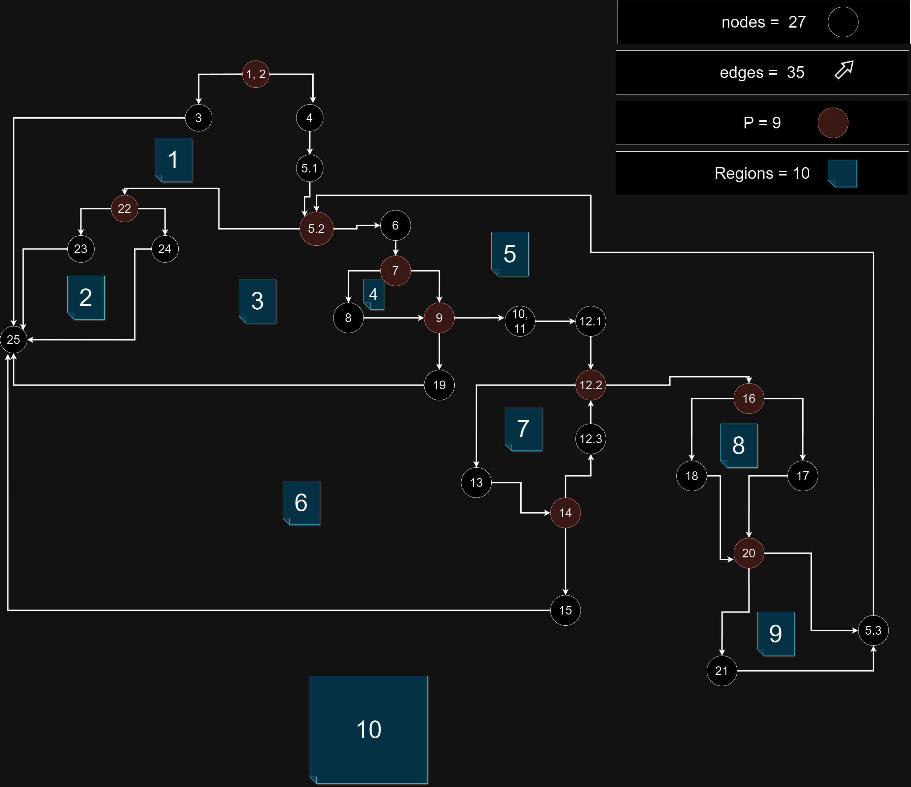
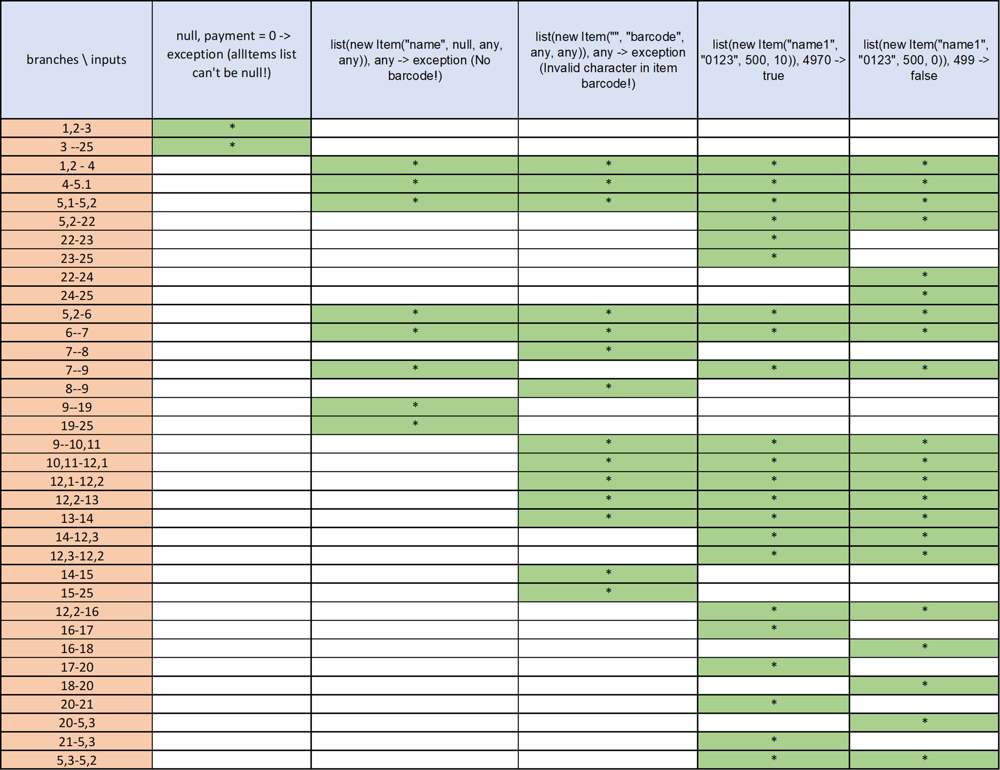
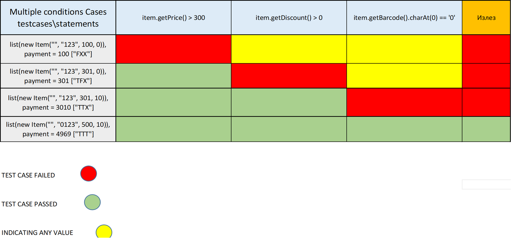

# Втора лабораториска вежба по Софтверско инженерство
---

## Сретен Главинчески, бр. на индекс 226019

---

### Control Flow Graph

---

### Цикломатска комплексност

Цикломатска комплесност на овој код е 10, истата ја може да се добие на повеќе начини:

Податоци од вежбата

Јазли: Nodes = 27;
Предикатни јазли: P = 9;
Гранки : Edges = 35;
Области : Regions = 10;

1. Прв начин:

    Cyclomatic complexity = Edges - Nodes + 2 = 35 - 27 + 2 = 10;

2. Втор начин:

    Cyclomatic complexity = p + 1 = 9 + 1 = 10;

3. Трет начин:

    Cyclomatic complexity = Regions = 10;

---

### Тест случаи според критериумот Every Branch

Овој дел од задачата беше решен така што целиот код беше тестиран со 5 напишани тестови и беа опфатени сите "case" сценарија.

1. null, payment = 0 -> exception (allItems list can't be null!)

    ex = assertThrows(RuntimeException.class, () -> SILab2.checkCart(null, 0));
    assertTrue(ex.getMessage().contains("allItems list can't be null!"));

2. list(new Item("name", null, any, any)), payment= any -> exception (No barcode!)

    ex = assertThrows(RuntimeException.class, () -> SILab2.checkCart(List.of(new Item("name", null, 0, 0)), 0));
    assertTrue(ex.getMessage().contains("No barcode!"));

3. list(new Item("", "barcode", any, any)), playment = any -> exception (Invalid character in item barcode!)

    ex = assertThrows(RuntimeException.class, () -> SILab2.checkCart(List.of(new Item("", "barcode", 0, 0)), 0));
    assertTrue(ex.getMessage().contains("Invalid character in item barcode!"));

4. list(new Item("name1", "0123", 500, 10)), playment = 4970 -> true

    assertEquals(true, SILab2.checkCart(Arrays.asList(new Item("name1", "0123", 500, 10)), 4970));

5. list(new Item("name1", "0123", 500, 0)), 499 -> false

   assertEquals(false, SILab2.checkCart(Arrays.asList(new Item("name1", "0123", 500, 0)), 499));

Според тест примерите се добива следната можна табела на влезови и кои ребра се изминати според истите (истата ја има и како .xlsx датотека во Repo - то):

---

### Тест случаи според критериумот Multiple Conditions

Во овој дел потребно беше да се напишат услови според критериумот Multiple Conditions за условот: 

if (item.getPrice() > 300 && item.getDiscount() > 0 && item.getBarcode().charAt(0)== '0'), 
при што истото беше изведено со 4 тестови.

1. [true:FXX]
   list(new Item("", "123", 100, 0)), payment = 100

    assertEquals(true, SILab2.checkCart(Arrays.asList(new Item("", "123", 100, 0)), 100));

2. [true:TFX]
   list(new Item("", "123", 301, 0)), payment = 301
   
    assertEquals(true, SILab2.checkCart(Arrays.asList(new Item("", "123", 301, 0)), 301));

3. [true:TTF]
   list(new Item("", "123", 301, 10)), payment = 3010

   assertEquals(true, SILab2.checkCart(Arrays.asList(new Item("", "123", 301, 10)), 3010));

4. [false:TTT]
   list(new Item("", "0123", 500, 10)), payment = 4969

    assertEquals(false, SILab2.checkCart(Arrays.asList(new Item("", "0123", 500, 10)), 4969));

Според тест примерите се добива следната можна табела на влезови и излези (истата ја има и како .xlsx датотека во Repo - то):

---

### Објаснување на напишаните Unit tests

Во првиот случај требаше да се напишат "case" сценарија за Every branch методата
при што требаше да се испитаат сите можности кои можат да се видат од нацртаниот "Controll flow Graph".

1. Во првиот случај (null, 0 -> exception (allItems list can't be null!)
    - Минуваме низ само две гранки (1,2-3, 3-25) при што кодот треба да фрли грешка од типот ("allItems list can't be null!") и да престане да се извршува. Воедно ова претставува 	најкраткиот пат.

2. Во вториот случај (list(new Item("name", null, any, any)), payment= any -> exception (No barcode!))
    - Во овој случај минуваме (1,2-4, 4-5.1, 5,1-5,2, 5,2-6, 6-7, 7-9, 9-19, 19-25) низ 8 гратки при што целта е кодот да фрли грешка од типот (No barcode!).

3. Во третиот случај (list(new Item("", "barcode", any, any)), playment = any -> exception (Invalid character in item barcode!) )
   - во третиот случај минуваме низ (1,2-4, 4-5.1, 5,1-5,2, 5,2-6, 6-7, 7-8, 8-9, 9-10,11, 10,11-12,1, 12,1-12,2, 12,2-13 ,13-14, 14-15, 15-25), 14 гранки што како резултат добиваме грешка од типот (Invalid character in item barcode!) при што кодот престанува да се извршува.

4. Во четвртиот случај (list(new Item("name1", "0123", 500, 10)), playment = 4970 -> true)
    - Во четвртиот случај минуваме низ (1,2-4, 4-5.1, 5,1-5,2, 5,2-6, 6-7, 7-9, 9-10.11, 10.11-12,1, 12,1-12,2, 12,2-13, 13-14, 14-12,3, 12,3-12,2, 12,2-16, 16-17, 17-20,
      20-21, 21-5,3, 5,3-5,2, 5,2-22, 22-23, 23-25) 22 гранки каде целта овој пат е кај условот if (sum <= payment) да врати true и да престане да се извршува 

5. Во петтиот случај (list(new Item("name1", "0123", 500, 0)), 499 -> false)
    - Во петтиот случај минуваме низ (1,2-4, 4-5.1, 5,1-5,2, 5,2-6, 6-7, 7-9, 9-10.11 10.11-12,1, 12,1-12,2, 12,2-13, 13-14, 14-12,3, 12,3-12,2, 12,2-16, 16-18, 18-20,
      20-5,3, 5,3-5,2, 5,2-22, 22-24, 24-25) 21 гранка, при што во овој случај сакаме да го добиеме спротивното од четвртиот случај односно условот if (sum <= payment) да врати false

   --- Сумарно со овие 5 тестови покриени се сите гранки по кои може да се извршува кодот.

Во Вториот случај требаше да се напишат "case" сценарија за Multiple conditions критериумот за условот if (item.getPrice() > 300 && item.getDiscount() > 0 && item.getBarcode().charAt(0)
== '0') и да се испитаат сите можности.

Сценарија:
1. Во првиот тест имаме (FXX) што значи дека ако првиот услов е false без разлика какви ке бидат останатите два услови, кодот паѓа;
2. Во вториот тест имаме (TFX) што значи дека ако вториот услов е false без разлика какви ке бидат останатите два услови кодот паѓа;
3. Во третиот тест имаме (TTF) што значи дека ако третиот услов е false без разлика какви ке бидат останатите два услови кодот паѓа;
4. Во третиот тест имаме (TTТ) што значи дека ако сите три услови се true, кодот успешно се извршува;

	

